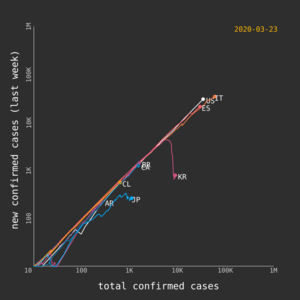

# COVID-19 Animation Generator


Generates an animation based on COVID-19 daily data.



- Explanation: [minutephysics: How To Tell If We're Beating COVID-19](https://www.youtube.com/watch?v=54XLXg4fYsc)
- Data: [Novel Coronavirus (COVID-19) Cases, provided by JHU CSSE](https://github.com/CSSEGISandData/COVID-19)

## Requirements

- Node 12.x
- Gulp: ```npm install -g gulp```

## Initialize

- Run: ```npm install```

## Build

- Clean: ```gulp clean```
- Build: ```gulp build```

## Running

```node dist/main```

The data is automatically downloaded from the [JHU CSSE repository](https://github.com/CSSEGISandData/COVID-19)

### Parameters

- ```--help``` (optional): Displays a help message and exits.
- ```--source``` (optional): Sets the data source. Default: ```global```. Possible values:
  - ```global```: Compare countries
  - ```us```: Compare states (US)
- ```--schema``` (optional): Sets the graph schema. Default: ```dark-vertical```. Possible values:
  - ```dark-vertical```: Vertical dark theme (1080x1920)
  - ```dark-square```: Square dark theme (1250x1250)
- ```--days``` (optional): Number of days for which the animation will be generated. Default: 20.
- ```--frames``` (optional): Number of frames per day. Default: 30.
- ```--extraFrames``` (optional): Number of extra frames for the last image. Default: 300.

#### Examples

- ```node dist/main```
- ```node dist/main --source global```
- ```node dist/main --schema dark-square```
- ```node dist/main --source us --schema dark-vertical```
- ```node dist/main --source us --schema dark-vertical --frames 20```

## Output

The generated images will be in the output directory

## Generate animation

You can use convert to generate an animation (60 fps). Requires ImageMagick (convert), parallel and ffmpeg. Run:

```
npm run video
```

The video will be here: ```output/animation.mp4```
